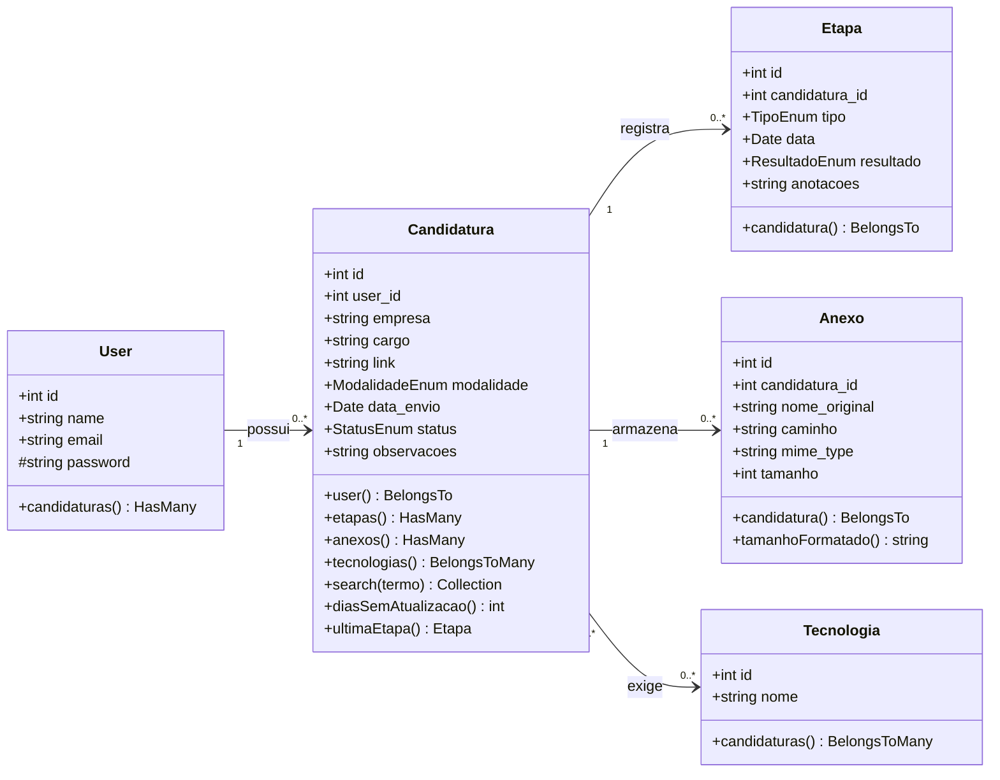
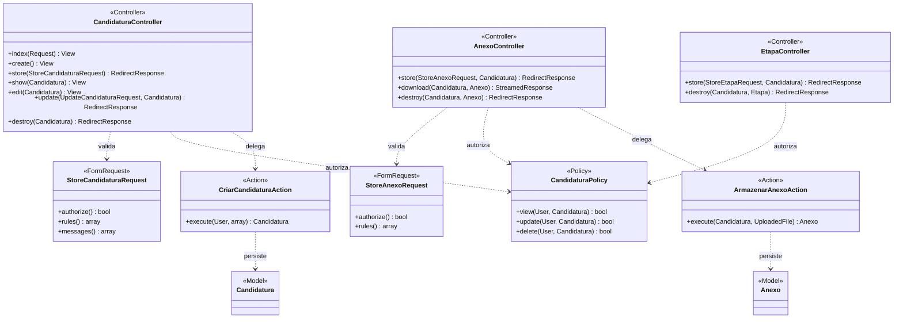

# Diagrama de Classes — JobTrack

**Disciplina:** TSI35D — Desenvolvimento de Aplicações Backend com Framework
**Artefato:** Diagrama de classes
**Versão:** 1.0 — Setembro/2026

Os diagramas abaixo são escritos em Mermaid e renderizados automaticamente pelo
GitHub. O primeiro apresenta o modelo de domínio (as classes de Model e seus
relacionamentos Eloquent). O segundo apresenta a camada de aplicação, mostrando
como as requisições são tratadas dentro do padrão MVC adotado pelo Laravel.

---

## 1. Modelo de domínio

### Observações sobre o domínio

- O atributo `user_id` de `Candidatura` é o eixo de toda a autorização do
  sistema. É a partir dele que a `CandidaturaPolicy` decide se o usuário
  autenticado pode visualizar, editar ou excluir o registro.
- O método `search` concentra a lógica de busca por empresa e cargo. Ele é
  isolado no Model justamente para poder ser coberto por testes unitários, sem
  depender de uma requisição HTTP.
- `diasSemAtualizacao` calcula o intervalo desde a última etapa registrada e
  alimenta o destaque de candidaturas paradas.
- O relacionamento N-N entre `Candidatura` e `Tecnologia` é intermediado pela
  tabela pivô `candidatura_tecnologia`, que não possui Model próprio por não
  carregar atributos adicionais.

---

## 2. Camada de aplicação

### Observações sobre a arquitetura

- **Form Requests** retiram as regras de validação do Controller. Cada classe
  concentra as regras de um formulário e as mensagens de erro correspondentes.
- **Policies** centralizam as regras de autorização. O Controller apenas
  consulta a Policy, sem repetir a comparação de propriedade em cada método.
- **Actions** isolam as operações de escrita que envolvem mais de um passo. O
  armazenamento de um anexo, por exemplo, grava o arquivo no storage e cria o
  registro no banco. Manter isso em uma classe própria deixa o Controller
  enxuto e a operação testável de forma isolada.
- O download de anexos passa por uma rota controlada em vez de link direto,
  porque os arquivos ficam fora do diretório público. Assim a autorização é
  verificada antes de o arquivo ser entregue.
