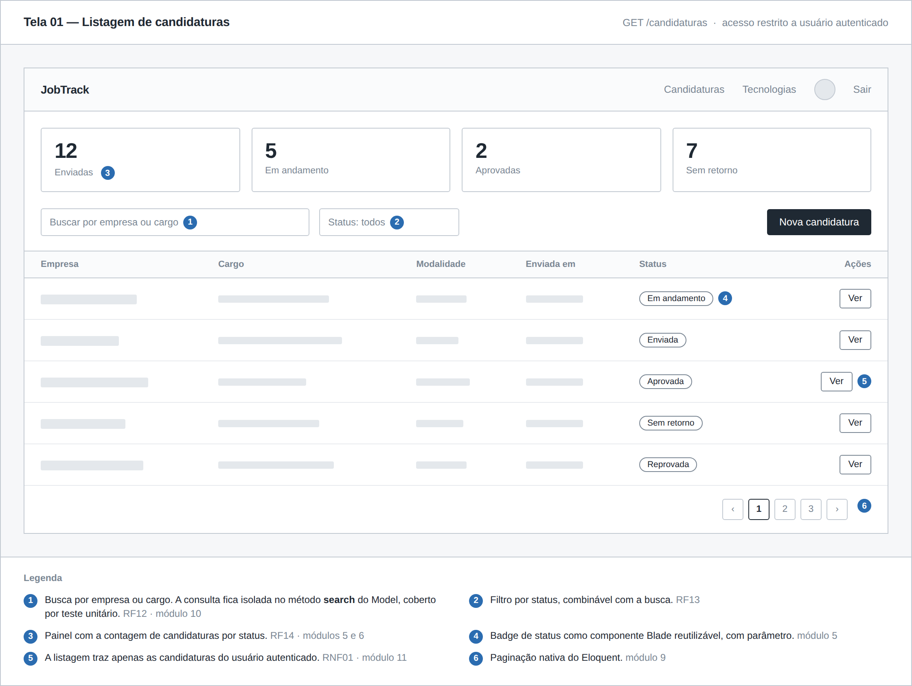
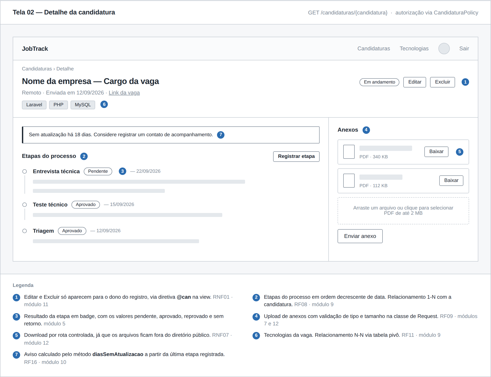
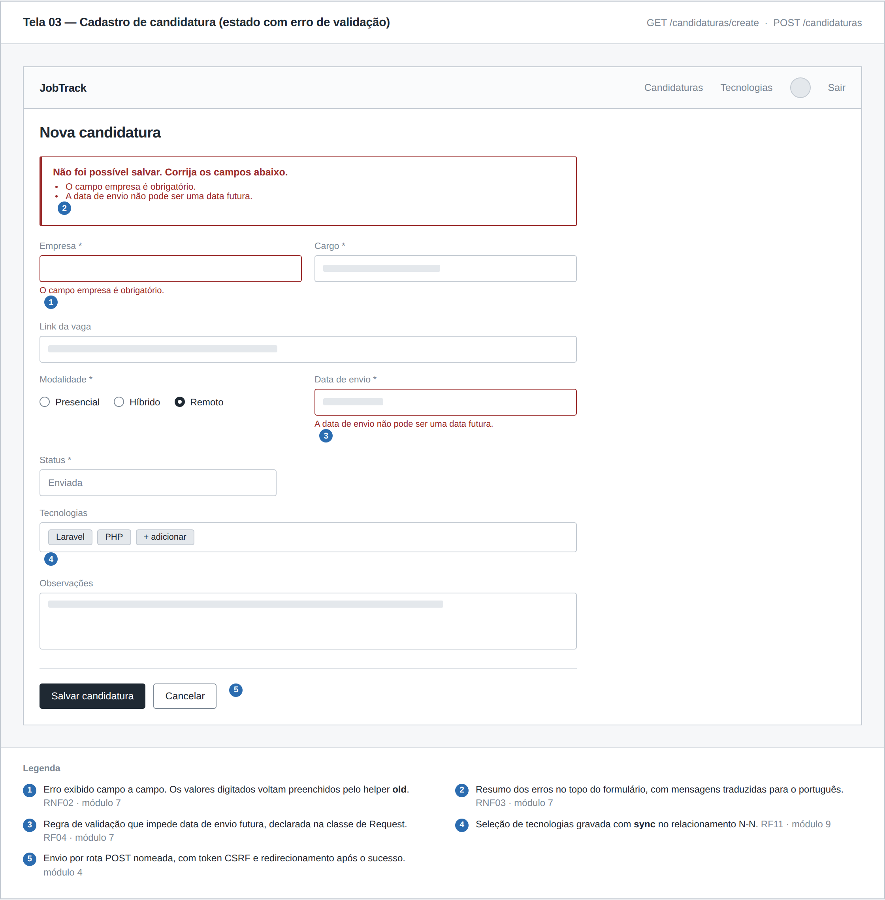

# Protótipo de Telas — JobTrack

**Disciplina:** TSI35D — Desenvolvimento de Aplicações Backend com Framework
**Artefato:** Prototipação de telas (wireframes)
**Versão:** 1.0 — Setembro/2026

Wireframes de média fidelidade das três telas principais da aplicação. Cada
tela traz uma legenda numerada relacionando os elementos da interface aos
requisitos do documento [`docs/requisitos.md`](../requisitos.md) e aos módulos
da disciplina em que serão implementados.

O arquivo [`wireframes.html`](wireframes.html) é a fonte dos desenhos. Para
alterar uma tela, edite o HTML e exporte a imagem novamente.

---

## Tela 01 — Listagem de candidaturas

`GET /candidaturas`

---

## Tela 02 — Detalhe da candidatura

`GET /candidaturas/{candidatura}`

---

## Tela 03 — Cadastro de candidatura

`GET /candidaturas/create` e `POST /candidaturas`

A tela é apresentada no estado com erro de validação, para documentar o
comportamento esperado do formulário quando os dados enviados não atendem às
regras definidas na classe de Request.

